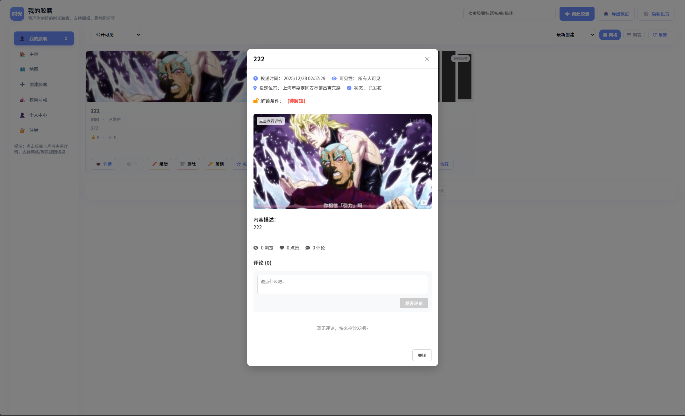
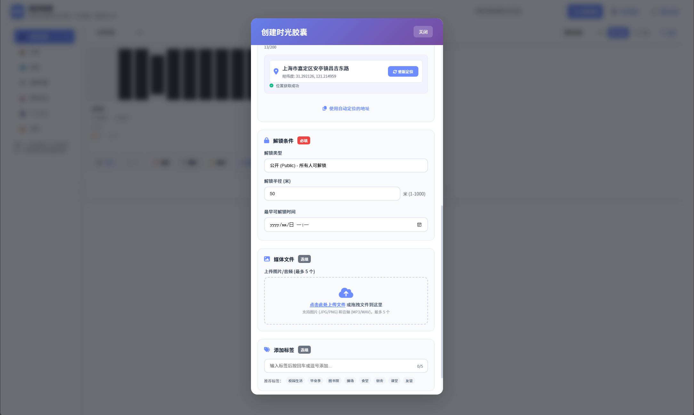
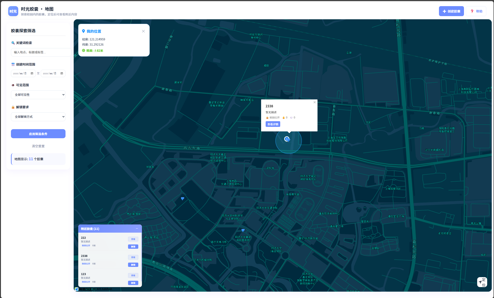

# Timecapsule

[](https://www.python.org/)
[](https://fastapi.tiangolo.com/)
[](https://vuejs.org/)
[](https://www.mysql.com/)
[](https://opensource.org/licenses/MIT)

> 以"时间"和"地点"为核心的数字记忆平台——在校园场景中捕捉并保存具有情感意义的瞬间，连接在校生与校友，促进校园文化的传承与情感共鸣。

---

## 📸 截图展示





---

## ✨ 核心功能

- 📍 **地点绑定记忆** — 在校园特定位置留下或查看数字足迹
- ⏰ **时间胶囊** — 设定解锁时间，让记忆在未来某刻重现
- 🔗 **在校生与校友连接** — 跨时代共享同一地点的故事
- 📷 **多媒体内容** — 支持图文等富媒体记忆存储

---

## 🛠️ 技术栈

**前端**：Vue 3 · Vite · Axios · Pinia

**后端**：Python · FastAPI · SQLAlchemy

**数据库**：MySQL

**工具**：Docker · Git

---

## 🚀 快速开始

### 环境要求

- Node.js >= 16
- Python >= 3.9
- MySQL >= 5.7
- Docker

### 安装步骤

**1. 克隆项目**

```bash
git clone https://github.com/awaken-psy/2025-tjcs-se.git
cd 2025-tjcs-se
```

**2. 后端设置**

```bash
cd backend
conda env create -f environment.yml
conda activate TimeCapsule
docker compose up --build -d
docker exec -it timecapsule_backend python scripts/init_database.py
```

**3. 前端设置**

```bash
cd frontend
npm install
npm run dev
```

**4. 环境配置**

在 `backend/` 目录下创建 `.env` 文件，配置数据库连接等环境变量。

**5. 项目部署**

```bash
bash setup.sh
```

---

## 📂 项目结构

```
timecapsule/
├── backend/
│   ├── app/
│   │   ├── api/        # API 路由接口
│   │   ├── core/       # 核心配置（config, security）
│   │   ├── crud/       # 数据库 CRUD 操作
│   │   ├── models/     # SQLAlchemy 数据库模型
│   │   └── schemas/    # Pydantic 数据验证模型
│   ├── main.py         # 程序入口
│   └── requirements.txt
├── frontend/
│   ├── src/
│   │   ├── router/     # 前端路由
│   │   ├── api/        # API 调用
│   │   ├── assets/     # 静态资源
│   │   ├── components/ # 公共组件
│   │   ├── views/      # 页面视图
│   │   └── stores/     # 状态管理（Pinia）
│   └── vite.config.ts
├── docs/               # 项目文档与截图
└── README.md
```

---

## 📡 API 文档

后端启动后，访问 Swagger UI 查看交互式文档：

```
http://localhost:8000/docs
```

---

## 📄 许可证

[MIT License](LICENSE)
